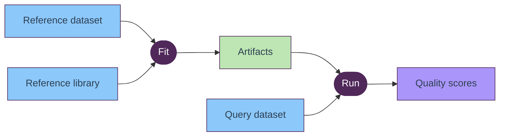
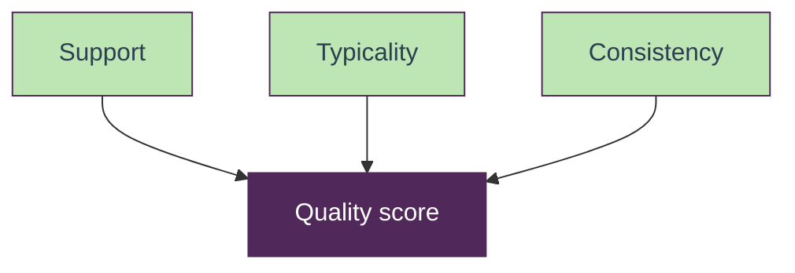

# `eosquality` at a glance

High-level view of how `eosquality` turns a reference dataset and a query into per-sample quality scores.

## Workflow

**Fit** learns per-column normalization and reference diagnostics from a reference dataset, anchored to a canonical reference library. **Run** scores each query sample against the fitted reference.

## Score composition

**Quality** is the geometric mean of three complementary signals: *support* (closeness to neighbors), *typicality* (plausibility of feature values), and *consistency* (uniformity of neighborhoods).
