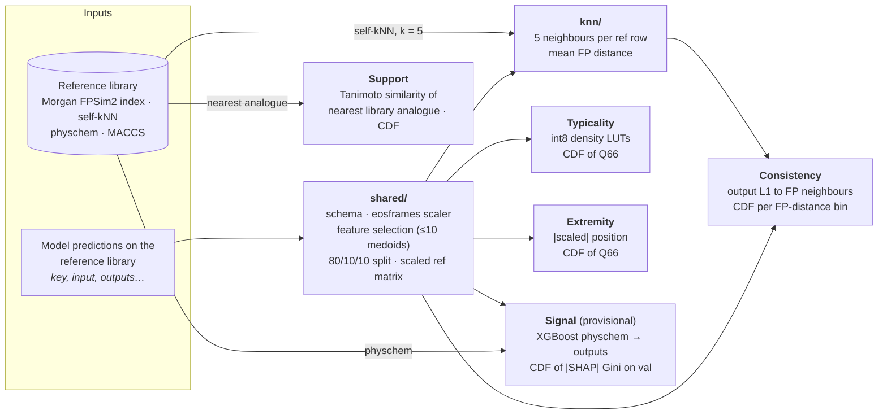
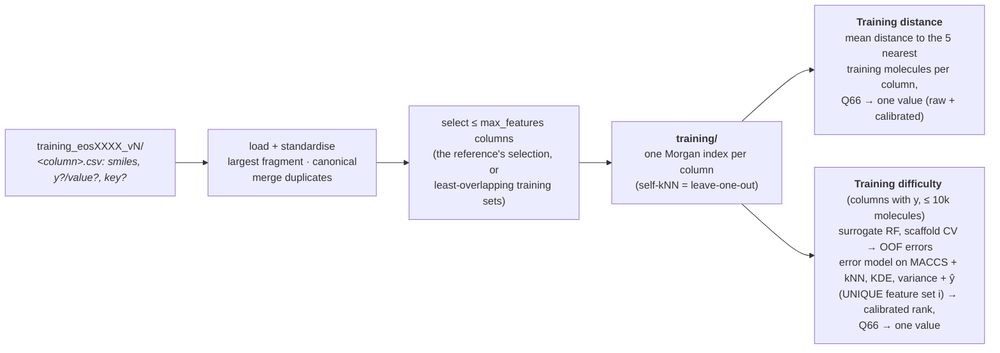
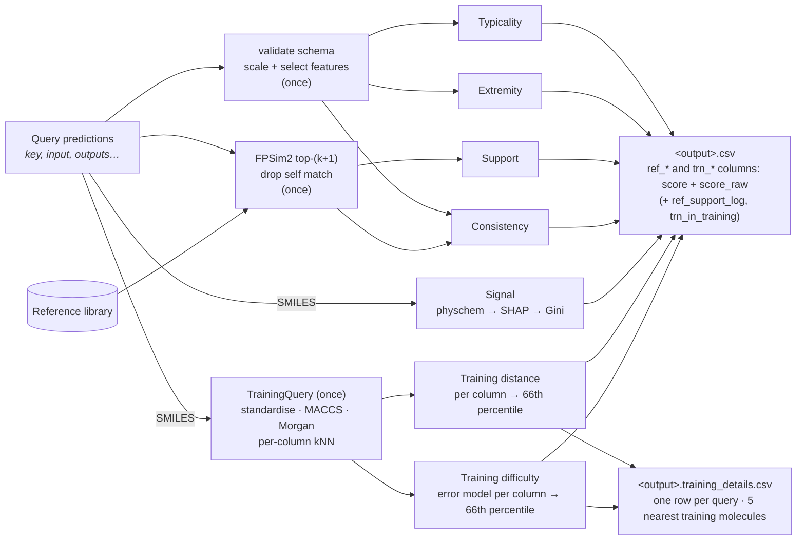

# Architecture

## Fit



## Fit — training modality



## Run



## Save layout

One subfolder per modality; either or both may be present.

```
<artifacts>/
  manifest.json                           # informational: eos_id, version, modalities, scores
  reference_mode/                         # iff fitted with -r/--reference
    shared/
      schema.json  scaler.json  binary_class_freq.json
      metadata.json                       # n_samples, library_id, vector_index_path, format_version, …
      reference_ids.json  splits.json  selected_columns.json
      reference_repr.npy                  # (n_ref, n_selected) scaled reference
    knn/state.json                        # {"k": 5}; iff support or consistency
    typicality/   state.json  reference_self_aggregates.npy  metadata.json
    extremity/    state.json  reference_self_aggregates.npy  metadata.json
    support/      state.json  reference_nearest_similarities.npy  metadata.json
    consistency/  state.json  reference_self_distances_per_bin.npz  metadata.json
    signal/       learner.json  learner.ubj  umbrella.json  reference_self_aggregates.npy
                  physchem_scaler.json  val_shap_attributions.npy  metadata.json
  training_mode/                          # iff fitted with -t/--training-sets
    training_sets/
      metadata.json                       # training_format_version, eos_id, version, columns
      columns.json  arrays.npz            # per column: n, y_kind, ids, y, predictions
      indices/c000/ …                     # one VectorIndex per output column
    training_distance/  state.json  loo_mean_distances.npz  metadata.json  # trn_distance
    training_difficulty/  state.json  metadata.json  # trn_difficulty; iff some column has ≥ 50 labels
      c000/ …           surrogate.joblib  density.joblib  error_model.joblib
                        arrays.npz  state.json      # one folder per labelled column
```

Each component's `metadata.json` records only `component`, `fit_timestamp`, `fit_duration_seconds` and `k`.

A standalone score class (e.g. `Support().fit(...).save(folder)`) writes its own subfolder plus the `shared/` (and `knn/`) folders it needs directly into `folder`. That is the same structure as one `reference_mode/`.
