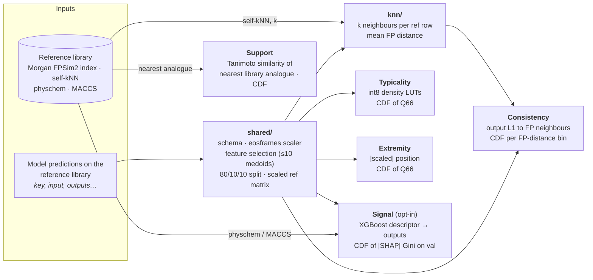
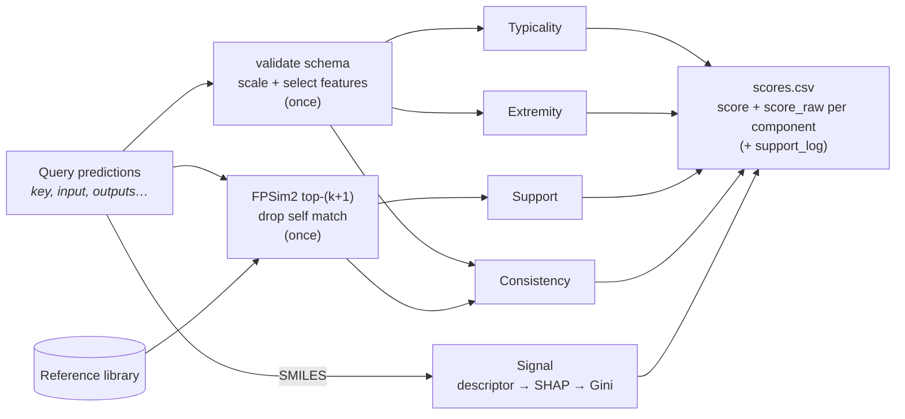

# Architecture

## Fit



## Run



## Save layout

```
<root>/
  manifest.json                         # informational summary (format_version, scores, k, library)
  shared/                               # always
    schema.json  scaler.json  binary_class_freq.json
    metadata.json                       # n_samples, library_id, vector_index_path, format_version, …
    reference_ids.json  splits.json  selected_columns.json
    reference_repr.npy                  # (n_ref, n_selected) scaled reference
  knn/state.json                        # {"k": …}; iff support or consistency
  typicality/   state.json  reference_self_aggregates.npy  metadata.json
  extremity/    state.json  reference_self_aggregates.npy  metadata.json
  support/      state.json  reference_nearest_similarities.npy  metadata.json
  consistency/  state.json  reference_self_distances_per_bin.npz  metadata.json
  signal/       learner.json  learner.ubj  umbrella.json  reference_self_aggregates.npy
                physchem_scaler.json (physchem only)  val_shap_attributions.npy  metadata.json
```

Each component's `metadata.json` records only `component`, `fit_timestamp`, `fit_duration_seconds` and `k`.
