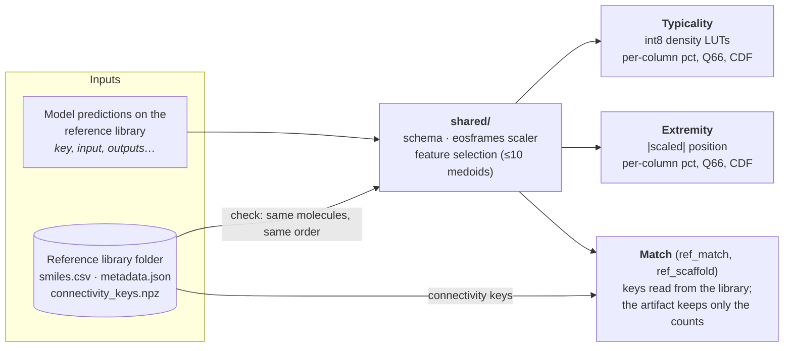
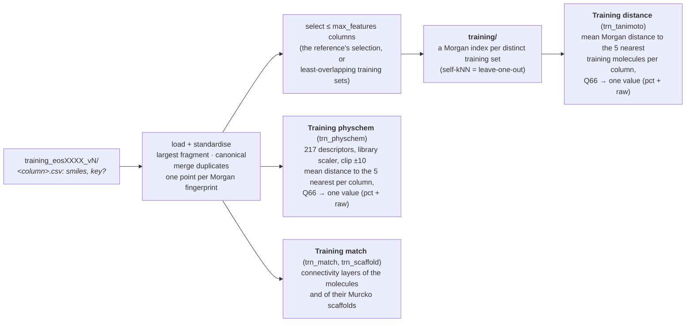
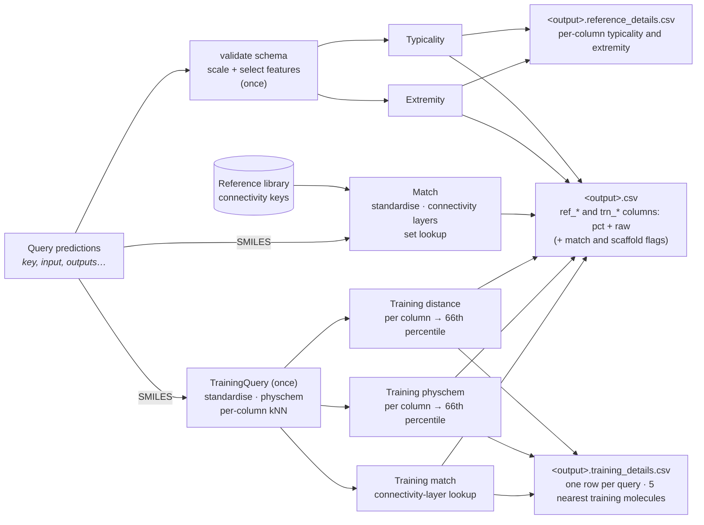

# Architecture

## Fit



## Fit — training modality



## Run



## Save layout

One subfolder per modality; either or both may be present.

```
<artifacts>/
  manifest.json                           # informational: eos_id, version, modalities, scores
  reference_mode/                         # iff fitted with -r/--reference
    shared/
      schema.json  scaler.json
      metadata.json                       # n_samples, library_id, library_path, format_version, …
      selected_columns.json
    typicality/   state.json  count_luts.npy  reference_self_aggregates.npy  metadata.json
    extremity/    state.json  column_tables.npz  reference_self_aggregates.npy  metadata.json
    match/        state.json  metadata.json        # counts only; the keys live in the library folder
  training_mode/                          # iff fitted with -t/--training-sets
    training_sets/
      metadata.json                       # training_format_version, eos_id, version, columns
      columns.json  arrays.npz            # per column: n, ids
      indices/c000/ …                     # one VectorIndex per distinct training set
    training_distance/  state.json  loo_mean_distances.npz  metadata.json  # trn_tanimoto
    training_physchem/  state.json  c000/ …  # trn_physchem: one domain per distinct training set
    training_match/  connectivity_keys.npz  metadata.json  # trn_match, trn_scaffold
```

Each component's `metadata.json` records only `component`, `fit_timestamp`, and `fit_duration_seconds`.

A standalone score class (e.g. `Typicality().fit(...).save(folder)`) writes its own subfolder plus the `shared/` folder it needs directly into `folder`. That is the same structure as one `reference_mode/`.
