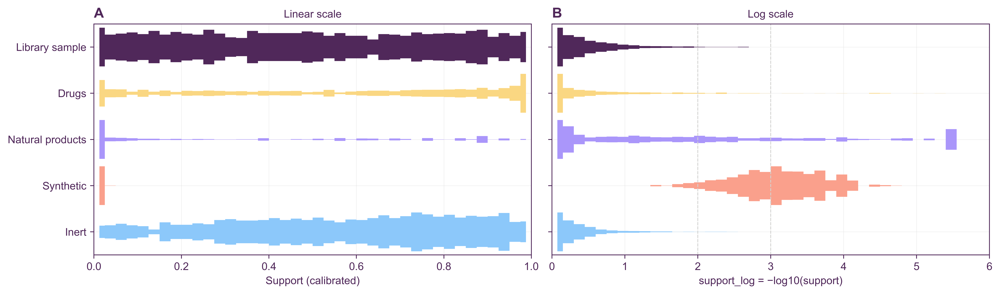

# Project status

**Status:** package `0.1.0`, library `ersilia_reference_library_v0` (1,355,109 molecules), artifact format 4. The project is a work in progress. The four default scores are functional and calibrated; Signal is provisional.

## Example results

To reproduce:
1. Run `scripts/run_all_scores.sh`. It fits all five scores for five Ersilia models (the `emh_paper` fit sets in `data/fit_examples/`) and scores 1,000 molecules from each of five query sets (`data/run_examples/`).
2. Run `scripts/figures/*.py` (in an environment with stylia) to regenerate the figures below.

| model | endpoint | outputs | kept after selection |
|---|---|---|---|
| eos3b5e | molecular weight | 1 | 1 |
| eos4e40 | *E. coli* activity | 1 | 1 |
| eos3804 | *A. baumannii* activity | 1 | 1 |
| eos42ez | cytotoxicity | 3 | 3 |
| eos7m30 | ADMET panel | 49 | 10 |

The query sets:
- **Library sample:** 1,000 molecules drawn from the reference library itself.
- **Drugs:** 43% of them are in the library.
- **Natural products, synthetic:** none are in the library.
- **Inert:** 0.4% are in the library.

### Calibration

**Library sample.** Library molecules should score roughly Uniform(0, 1) on every score. For every model and score, the KS distance to uniform is at most 0.044, against a 95% critical value of 0.043 for n = 1,000. That is within sampling noise for 25 tests.

**Full reference.** The `reference_<score>` anchors are exactly 0.500, thanks to mid-rank calibration. Format 1 had 0.505–0.509 for typicality on the one-output models.

**Typicality steps.** Typicality's ECDF moves in steps for those one-output models because their raw typicality has only about 130 distinct values across 1.35M molecules (int8 density levels). Ties cannot spread out into a uniform distribution. Mid-rank centres them rather than biasing them upward.

### Distributions

- **Library sample:** flat for every score, as expected.
- **Support:** separates chemistry cleanly. Synthetic and most natural-product molecules sit at about 0, drugs and inert molecules lean high, and the library sample is uniform. Support depends on chemistry only, so it is identical across models.
- **Output-based scores** react per model:
  - The MW model gives natural products and synthetic molecules extreme, atypical predictions and very low consistency.
  - The Cytotox model treats synthetic molecules as typical but noisy.
- **Inert set:** looks like the library sample on the output scores. That is expected: its median distance to the library (0.36) equals the library's own, so these molecules are chemically library-like even though only 0.4% of them are in it.

### Support: closest library analogue

Since format 4, support asks whether the library contains a close analogue of the molecule. The raw value is the Tanimoto similarity of the nearest library molecule; the dashed lines in panel A mark 0.4 (related chemistry), 0.6 (close analogue) and 0.8 (near-identical).

| Query set | nearest-analogue similarity (median) | support median | `support_log` median (p90) |
|---|---|---|---|
| Library sample | 0.73 | 0.51 | 0.30 (1.10) |
| Drugs | 0.74 | 0.55 | 0.26 (1.72) |
| Natural products | 0.59 | 0.15 | 0.83 (4.52) |
| Synthetic | 0.26 | < 0.001 | 4.07 (4.83) |
| Inert | 0.72 | 0.50 | 0.30 (0.93) |

What the panels show:
- **Synthetic molecules.** 99% have no library analogue at Tanimoto ≥ 0.4. They are generated, strained ring systems unlike the drug-like library.
- **Natural products** split into two groups: those with real analogues in the library (around 0.7) and novel scaffolds (0.2–0.4).
- **Drugs.** The spike of drugs at 1.0 consists of drugs with a fingerprint-identical stereoisomer in the library (see the self-match rule under Decisions to review).
- **The 0–1 scale** collapses everything far from the library onto 0; `support_log` keeps those molecules apart.

**How the definition was chosen.** These options were compared on the five query sets:
- **Nearest-analogue similarity (chosen).** It calibrates as well as the previous definition (KS 0.024) and separates natural products from library molecules best (AUC 0.79).
- **Mean distance to the 5 nearest neighbours (format 1–2).** AUC 0.72 for natural products.
- **Analogue counts above 0.4 or 0.6.** Too many ties to calibrate (KS up to 0.25).
- **Calibration within fingerprint-size bins (format 3).** Removed the size bias, but tracked neighbour output disagreement no better on average and hid size effects that matter for property models such as MW and ADMET.

### Redundancy

Spearman correlations between calibrated scores, pooled over all queries of a model:
- **Typicality vs extremity:** ρ = −0.56 to −0.95 (−0.85 to −0.95 for the one-output models). For single-output models the two are nearly redundant: a value far from the centre is almost always a rare value.
- **Typicality vs consistency:** moderately correlated (0.21–0.61).
- **Support** is roughly independent of the output scores except for MW (0.64 with typicality), where molecular weight is itself a chemical-space proxy.
- **Signal** is weakly correlated with everything (|ρ| ≤ 0.54).

### What changed since the previous artifacts

Comparing the current scores on the 25 example sets with format 1 (old CSVs in `output/format1/`; old calibration plot `figures/reference_calibration_format1.png`). 
- **Extremity and signal:** unchanged.
- **Typicality:** shifted by at most 0.017 (mid-rank ties).
- **Missing values:** none of the five example models have NaN outputs, so the NaN-policy fixes do not affect these examples. They matter for models with missing outputs.
- **Self-match rule:** about 25% of drugs gained support and consistency changed for them. These are molecules not in the library as written whose stereo-free form is (see Decisions to review).
- **Support:** redefined as nearest-analogue similarity (format 4; see above). Format-2 and format-3 outputs are kept in `output/format2/` and `output/format3/`.

## Decisions to review

- **Self-match rule (support/consistency).** A query now drops only the neighbour that is the same molecule (same SMILES or canonical isomeric SMILES). A different stereoisomer with an identical Morgan fingerprint stays as a distance-0 neighbour, exactly as in the library's own self-kNN, so the calibration is consistent.
  - The alternative treats any fingerprint-identical neighbour as "self". That gives lower support to stereo-variants of library molecules, but it is inconsistent with how the reference CDF is built.
- **Typicality/extremity redundancy.** Consider reporting only one for single-output models, or replacing extremity with a score that is less tied to density.

## Known limitations

- **Signal is provisional.**
  - It trains on 1,000 rows by default (`--max-signal-samples`).
  - With physchem descriptors, raw Gini values cluster near their maximum (about 0.99 on the test fixture), so most of the discrimination comes from small differences.
  - The full val-slice |SHAP| matrix is saved to `signal/val_shap_attributions.npy` so other reductions can be prototyped offline.
- **Feature selection** keeps at most 10 outputs (10 of 49 for eos7m30).
- **Support and molecule size:** Tanimoto similarity is lower for small molecules, so small fragments look somewhat more novel than they are. This is not corrected for (see Support).
- **Typicality resolution** is limited by int8 quantisation for one-output models (about 130 levels).
- **Library lookup** looks in `./data/indices/` relative to the current working directory. From elsewhere, set `EOSQUALITY_REFERENCE_LIBRARY_PATH` or run `eosquality setup`.
- **Run time** for 1,000 queries is about 15 s with all five scores, dominated by FPSim2 queries (about 10 ms each). Queries run single-threaded on purpose: multi-threaded FPSim2 returns ties in an unstable order, which made consistency non-reproducible. Fitting one model takes a few minutes.
- `binary_class_freq` is computed and saved, but no score reads it.

## Training modality (in progress)

Each output column can have its own training set. It is fitted with `--training-sets`, alone or with `--reference`, or added to existing artifacts with `--artifacts`.

| Stage | Adds | Needs | Status |
|---|---|---|---|
| 1 | Training data loader (standardisation, duplicate merging, label kind) | SMILES (y optional) | done |
| 2 | `training_distance`: one whole-model value per molecule, the Q66 across columns of the mean Morgan distance to the 5 nearest training molecules, raw and calibrated on each column's leave-one-out values (no cutoff) + nearest training molecules | SMILES | done |
| 3 | `training_difficulty`: learned error model per labelled column, following UNIQUE (surrogate RF with scaffold CV; base UQ: kNN distance, 3 KDEs, ensemble variance, top-1 probability; transformed UQ: DiffkNN on prediction and variance, plus label-based local error and spread; MACCS as data features; best of UNIQUE's 3 feature sets by OOF Spearman), calibrated rank, Q66 → one value | y | done (validated on synthetic data only) |
| 4 | Conformal expected-error intervals | labelled molecules outside the training set | planned |

Validation uses training sets only: split by scaffold, fit a surrogate model, and check that the scores predict its error on held-out molecules (`scripts/evaluate_training.py`: Spearman, AUROC, sparsification gain against the oracle, random baseline 0). So far this has only been run on a synthetic set whose labels are noisy for sulfur-containing molecules: `training_difficulty` reaches Spearman 0.35 there, while `training_distance` is at random level, because the noise is unrelated to novelty. Real endpoints are pending.

## Open items

Carried over from the previous README TODO list:

- [ ] Raise the feature-selection cap from 10 to around 30 columns.
- [ ] Signal: train on more rows (e.g. 100,000) and check how stable calibration is. Early stopping already evaluates 5,000 val rows, and calibration already uses the full val slice (about 135k rows).
- [ ] Signal: choose training compounds for quality (e.g. high consistency, diverse) instead of at random.
- [ ] Signal: handle trivial models (e.g. molecular weight), where a few descriptors explain everything. One option is to bin the reference.

New:

- [ ] Decide on the self-match rule and on typicality/extremity redundancy (see Decisions to review).
- [ ] Consider a log-scale companion for the other scores if their tails also matter.
- [ ] Before pushing, check that CI passes on GitHub (`.github/workflows/ci.yml`).
