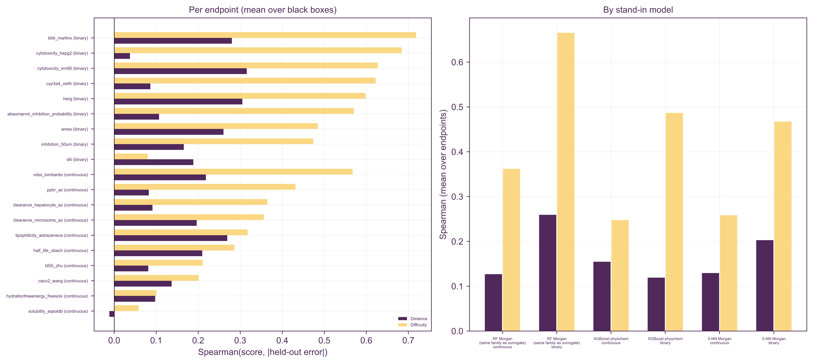

# Project status

**Status:** package `0.1.0`, library `ersilia_reference_library_v0` (1,355,109 molecules), artifact format 7, training format 5. The project is a work in progress. Typicality, extremity, support and consistency are functional and calibrated; Signal is provisional.

## Example results

To reproduce:
1. Run `scripts/run_all_scores.sh`. It fits all five scores for five Ersilia models (the `emh_paper` fit sets in `data/fit_examples/`) and scores 1,000 molecules from each of five query sets (`data/run_examples/`).
2. Run `scripts/figures/*.py` (in an environment with stylia) to regenerate the figures below.

| model | endpoint | outputs | kept after selection |
|---|---|---|---|
| eos3b5e | molecular weight | 1 | 1 |
| eos4e40 | *E. coli* activity | 1 | 1 |
| eos3804 | *A. baumannii* activity | 1 | 1 |
| eos42ez | cytotoxicity | 3 | 3 |
| eos7m30 | ADMET panel | 49 | 10 |

The query sets:
- **Library sample:** 1,000 molecules drawn from the reference library itself.
- **Drugs:** 43% of them are in the library.
- **Natural products, synthetic:** none are in the library.
- **Inert:** 0.4% are in the library.

### Calibration

**Library sample.** Library molecules should score roughly Uniform(0, 1) on every score. For every model and score, the KS distance to uniform is at most 0.044, against a 95% critical value of 0.043 for n = 1,000. That is within sampling noise for 25 tests.

**Full reference.** The `reference_<score>` anchors are exactly 0.500, thanks to mid-rank calibration. Format 1 had 0.505–0.509 for typicality on the one-output models.

**Typicality steps.** Typicality's ECDF moves in steps for those one-output models because their raw typicality has only about 130 distinct values across 1.35M molecules (int8 density levels). Ties cannot spread out into a uniform distribution. Mid-rank centres them rather than biasing them upward.

### Distributions

- **Library sample:** flat for every score, as expected.
- **Support:** separates chemistry cleanly. Synthetic and most natural-product molecules sit at about 0, drugs and inert molecules lean high, and the library sample is uniform. Support depends on chemistry only, so it is identical across models.
- **Output-based scores** react per model:
  - The MW model gives natural products and synthetic molecules extreme, atypical predictions and very low consistency.
  - The Cytotox model treats synthetic molecules as typical but noisy.
- **Inert set:** looks like the library sample on the output scores. That is expected: its median distance to the library (0.36) equals the library's own, so these molecules are chemically library-like even though only 0.4% of them are in it.

### Support: closest library analogue

Since format 4, support asks whether the library contains a close analogue of the molecule. The raw value is the Tanimoto similarity of the nearest library molecule; the dashed lines in panel A mark 0.4 (related chemistry), 0.6 (close analogue) and 0.8 (near-identical).

| Query set | nearest-analogue similarity (median) | support median | `ref_support_log` median (p90) |
|---|---|---|---|
| Library sample | 0.73 | 0.51 | 0.30 (1.10) |
| Drugs | 0.74 | 0.55 | 0.26 (1.72) |
| Natural products | 0.59 | 0.15 | 0.83 (4.52) |
| Synthetic | 0.26 | < 0.001 | 4.07 (4.83) |
| Inert | 0.72 | 0.50 | 0.30 (0.93) |

What the panels show:
- **Synthetic molecules.** 99% have no library analogue at Tanimoto ≥ 0.4. They are generated, strained ring systems unlike the drug-like library.
- **Natural products** split into two groups: those with real analogues in the library (around 0.7) and novel scaffolds (0.2–0.4).
- **Drugs.** The spike of drugs at 1.0 consists of drugs with a fingerprint-identical stereoisomer in the library (see the self-match rule under Decisions to review).
- **The 0–1 scale** collapses everything far from the library onto 0; `ref_support_log` keeps those molecules apart.

**How the definition was chosen.** These options were compared on the five query sets:
- **Nearest-analogue similarity (chosen).** It calibrates as well as the previous definition (KS 0.024) and separates natural products from library molecules best (AUC 0.79).
- **Mean distance to the 5 nearest neighbours (format 1–2).** AUC 0.72 for natural products.
- **Analogue counts above 0.4 or 0.6.** Too many ties to calibrate (KS up to 0.25).
- **Calibration within fingerprint-size bins (format 3).** Removed the size bias, but tracked neighbour output disagreement no better on average and hid size effects that matter for property models such as MW and ADMET.

### Redundancy

Spearman correlations between calibrated scores, pooled over all queries of a model:
- **Typicality vs extremity:** ρ = −0.56 to −0.95 (−0.85 to −0.95 for the one-output models). For single-output models the two are nearly redundant: a value far from the centre is almost always a rare value.
- **Typicality vs consistency:** moderately correlated (0.21–0.61).
- **Support** is roughly independent of the output scores except for MW (0.64 with typicality), where molecular weight is itself a chemical-space proxy.
- **Signal** is weakly correlated with everything (|ρ| ≤ 0.54).

### What changed since the previous artifacts

Comparing the current scores on the 25 example sets with format 1 (old CSVs in `output/format1/`; old calibration plot `figures/reference_calibration_format1.png`). 
- **Extremity and signal:** unchanged.
- **Typicality:** shifted by at most 0.017 (mid-rank ties).
- **Missing values:** none of the five example models have NaN outputs, so the NaN-policy fixes do not affect these examples. They matter for models with missing outputs.
- **Self-match rule:** about 25% of drugs gained support and consistency changed for them. These are molecules not in the library as written whose stereo-free form is (see Decisions to review).
- **Support:** redefined as nearest-analogue similarity (format 4; see above). Format-2 and format-3 outputs are kept in `output/format2/` and `output/format3/`.

## Decisions to review

- **Self-match rule (support/consistency).** A query now drops only the neighbour that is the same molecule (same SMILES or canonical isomeric SMILES). A different stereoisomer with an identical Morgan fingerprint stays as a distance-0 neighbour, exactly as in the library's own self-kNN, so the calibration is consistent.
  - The alternative treats any fingerprint-identical neighbour as "self". That gives lower support to stereo-variants of library molecules, but it is inconsistent with how the reference CDF is built.
- **Typicality/extremity redundancy.** Consider reporting only one for single-output models, or replacing extremity with a score that is less tied to density.

## Known limitations

- **Signal is provisional.**
  - It trains on 1,000 rows (a fixed setting).
  - With physchem descriptors, raw Gini values cluster near their maximum (about 0.99 on the test fixture), so most of the discrimination comes from small differences.
  - The full val-slice |SHAP| matrix is saved to `signal/val_shap_attributions.npy` so other reductions can be prototyped offline.
- **Feature selection** keeps at most 10 outputs (10 of 49 for eos7m30). With
  training sets, the candidates are first restricted to the columns that have
  one (41 of eos7m30's 49), and both modalities then use the same 10.
- **Support and molecule size:** Tanimoto similarity is lower for small molecules, so small fragments look somewhat more novel than they are. This is not corrected for (see Support).
- **Typicality resolution** is limited by int8 quantisation for one-output models (about 130 levels).
- **Library lookup** looks in `./data/indices/` relative to the current working directory. From elsewhere, set `EOSQUALITY_REFERENCE_LIBRARY_PATH` or run `eosquality setup`.
- **Run time** for 1,000 queries is about 15–25 s with all five scores, dominated by FPSim2 queries (about 10 ms each) and Signal's descriptors. Queries run single-threaded on purpose: multi-threaded FPSim2 returns ties in an unstable order, which made consistency non-reproducible. Fitting one model takes about a minute without Signal; Signal adds a few minutes (SHAP over the ~135k-row val slice). Typicality and extremity fit in under a second each.
- **Training-set quality is not assessed.** The loader standardises SMILES,
  merges duplicates and reports how many rows it dropped or merged, but a set
  whose labels are wrong, whose assay differs from the deployed model's, or
  which is not actually the model's training data will be scored against
  anyway. `trn_*` answers "how does this molecule relate to the data in this
  folder", not "was this model trained well".
- `binary_class_freq` is computed and saved, but no score reads it.

## Training modality (in progress)

Each output column can have its own training set. It is fitted with
`-t/--training-sets`, alone or together with `-r/--reference`; with both, the
reference scores use only the columns that have a training set.

Read that figure critically: against every example query set, including a
sample of the reference library itself, the distance percentile (now published
as the similarity `trn_tanimoto_pct`, one minus it) sits far from the training
set's own typical value and often saturates. That is honest — the training sets hold a few
thousand molecules against a 1.35M-molecule library, so almost any query is
farther from them than their molecules are from each other — but it leaves
the calibrated score with little resolution once everything is "far", which
is why `trn_tanimoto_raw` is reported alongside it (the same trade-off as
`ref_support_log`). The figure predates the physchem and match scores and shows the old column names.
Drugs are the closest set for eos4e40 (E. coli), whose training data is a
drug-like screen; the synthetic set is the farthest for every model.

| Stage | Adds | Needs | Status |
|---|---|---|---|
| 1 | Training data loader (standardisation, duplicate merging, label kind) | SMILES (y optional) | done |
| 2 | `trn_tanimoto`: one whole-model value per molecule, the Q66 across columns of the mean Morgan distance to the 5 nearest training molecules, published as similarities (`_raw`, and `_pct` calibrated on each column's leave-one-out values; no cutoff) + nearest training molecules | SMILES | done |
| 2b | `trn_physchem` (the same in library-scaled physchem space), `trn_match` and `trn_scaffold` (connectivity-layer lookups) | SMILES | done |
| 3 | `trn_difficulty`: learned error model per labelled column (surrogate RF with scaffold CV; four scalar inputs), calibrated rank, Q66 → one value | y | built, **parked** (off by default); the validation below used the earlier MACCS + KDE inputs |
| 4 | Conformal expected-error intervals | labelled molecules outside the training set | planned |

### Validation on the Ersilia example training sets

These numbers are for the error model `trn_difficulty`, which is parked, with the inputs it had then (MACCS keys and three KDEs, since replaced by four scalars); they have not been re-measured.

The headline evidence, on the example models' own training data.

**Protocol** (`scripts/evaluate_training.py`, Protocol B). Split one labelled
training set 80/20 by Murcko scaffold; fit the training modality on the 80%;
train a stand-in "black-box" model on the same 80%; then ask how well each
training score ranks that model's absolute errors on the held-out 20%. Three
stand-ins are used: `rf_morgan` (a random forest on Morgan bits, the same
family as difficulty's own surrogate, so partly circular), `xgb_physchem`
(XGBoost on physicochemical descriptors) and `knn_morgan` (5-NN on Morgan
bits). The last two are the transfer case an Ersilia black box represents.

`scripts/evaluate_training_sets.py` runs this over 19 endpoints of the four
example models and writes `output/training_validation.csv`;
`scripts/figures/training_validation.py` plots it.

Spearman of each score against the held-out |error|, averaged over the three
stand-in models. † marks a value inside the permutation baseline, i.e.
indistinguishable from random ranking.

| endpoint | label | train | distance | difficulty |
|---|---|---|---|---|
| bbb_martins | binary | 1,580 | 0.28 | **0.72** |
| cytotoxicity_hepg2 | binary | 7,998 | 0.04 | **0.68** |
| cytotoxicity_imr90 | binary | 7,998 | 0.32 | **0.63** |
| cyp3a4_veith | binary | 8,000 | 0.09 | **0.62** |
| herg | binary | 507 | 0.31 | **0.60** |
| abaumannii_inhibition_probability | binary | 6,145 | 0.11 | **0.57** |
| ames | binary | 5,356 | 0.26 | **0.48** |
| inhibition_50um | binary | 1,867 | 0.17 | **0.47** |
| dili | binary | 373 | **0.19** | 0.08† |
| vdss_lombardo | continuous | 888 | 0.22 | **0.57** |
| ppbr_az | continuous | 1,435 | 0.08 | **0.43** |
| clearance_hepatocyte_az | continuous | 816 | 0.09† | **0.36** |
| clearance_microsome_az | continuous | 875 | 0.20 | **0.36** |
| lipophilicity_astrazeneca | continuous | 3,359 | 0.27 | **0.32** |
| half_life_obach | continuous | 532 | 0.21 | **0.29** |
| ld50_zhu | continuous | 5,860 | 0.08 | **0.21** |
| caco2_wang | continuous | 695 | 0.14 | **0.20** |
| hydrationfreeenergy_freesolv | continuous | 432 | 0.10 | **0.10** |
| solubility_aqsoldb | continuous | 7,929 | -0.01 | **0.06** |

Read this critically:

- **Difficulty beats distance in 18 of 19 endpoints**, and it still does when
  the stand-in model is not a random forest (mean 0.48 binary, 0.25
  continuous, against 0.16 and 0.14 for distance).
- **Binary endpoints score far higher than continuous ones, and it is not
  circularity.** The obvious suspicion is that for a binary label `|y − p|`
  is nearly a function of the classifier's confidence, which the error model
  sees (`probability_top1`, ensemble variance, and the prediction itself,
  which for a binary label *is* P(y = 1)). Removing all three and leaving
  only structure (MACCS, kNN distance, the three KDEs) cost at most 0.07:
  hERG 0.52 → 0.50, BBBP 0.67 → 0.60, `inhibition_50um` 0.41 → 0.41. So the
  binary advantage is in the chemistry, not in re-reading the confidence
  (`scripts/ablate_confidence_inputs.py`). A likelier explanation is that
  ranking a bounded, bimodal `|y − p|` is simply an easier task than ranking a
  continuous residual. Either way, do not compare a binary column's number
  with a continuous one.
- **The continuous numbers are the conservative read** (0.25–0.29 mean), and
  they sit in the range Novartis reports for error models on public ADME data
  (0.16–0.46 on public sets, 0.06–0.39 on their in-house ones: Parrondo-Pizarro
  et al., *JCIM* 2026, 66(2), 923–935, §3.2.3). Their error models also beat
  every standard UQ metric they tested, so this is the band to judge
  `trn_difficulty` against, not 1.0.
- **Three endpoints fail.** On `solubility_aqsoldb` both scores are ~0: a
  7,929-molecule set covering very diverse chemistry, where held-out error is
  driven by measurement noise more than by locality.
  `hydrationfreeenergy_freesolv` (432 molecules) is too small for either score
  to say anything. On `dili` difficulty is indistinguishable from random while
  distance is not. The per-column `trn_difficulty_spearman` in the run
  metadata is the warning sign to check before trusting the score on a given
  column, and the fit warns when it falls below 0.2.
- **Ranking, not flagging.** Mean AUROC for picking the top-quartile errors
  is 0.76 (binary) and 0.67 (continuous) for difficulty, 0.57 for distance.
  Useful for triage, far from a decision rule.
- **Calibration holds on real artifacts.** 400 training molecules of
  eos4e40 scored against their own fitted artifacts average 0.492
  (the Morgan distance percentile) and 0.503 (`trn_difficulty`), and all 400 are flagged
  `trn_in_training` — the leave-one-out and out-of-fold construction does
  what it claims.
- **The per-column values are not redundant.** On eos7m30's 10 selected
  columns, the median pairwise Spearman between per-column distances is 0.50,
  so the Q66 across columns is aggregating genuinely different views rather
  than repeating one. Calibration also spreads the per-column values (mean
  within-molecule sd 0.18, against 0.09 raw), and the calibrated and raw
  whole-model values rank queries slightly differently (ρ = 0.95).

### Design benchmark (MoleculeNet)

The score's design was chosen on public data, with the same protocol.
Results on six MoleculeNet endpoints follow (Spearman of score vs held-out |error|). † marks a value within the permutation baseline (95th percentile of |ρ| under 1,000 permutations), i.e. indistinguishable from random. Bold is the better of the two scores.

| endpoint | rf_morgan: distance / difficulty | xgb_physchem: distance / difficulty | knn_morgan: distance / difficulty |
|---|---|---|---|
| ESOL | 0.09† / **0.40** | -0.10† / **0.03†** | 0.10 / **0.31** |
| Lipophilicity | 0.28 / **0.34** | 0.22 / **0.26** | 0.32 / **0.35** |
| BBBP (binary) | 0.41 / **0.79** | 0.25 / **0.69** | 0.27 / **0.62** |
| FreeSolv | -0.04† / **0.08†** | **0.29** / 0.15 | 0.04† / **0.07†** |
| BACE pIC50 | 0.26 / **0.36** | 0.04† / **0.18** | 0.28 / **0.35** |
| BACE class (binary) | 0.17 / **0.69** | 0.07† / **0.60** | 0.11 / **0.54** |
| mean | 0.20 / 0.45 | 0.13 / 0.32 | 0.19 / 0.37 |

What the table shows:
- **Difficulty beats distance** in 17 of 18 cases, including against the two black boxes that differ from its surrogate, so it is not only learning its own random forest.
- **Binary endpoints gain most.** For them the error is dominated by classifier confidence, which the error model sees through the surrogate's probability and tree variance.
- **Continuous endpoints are harder.** The values (0.3–0.4) are in the range Novartis reports for error models on public ADME data (Spearman 0.16–0.46, Parrondo-Pizarro et al., *JCIM* 2026, 66(2), 923–935).
- **Small sets are noise.** FreeSolv (432 training molecules, 210 test) is noise for everything, and XGBoost on physchem descriptors is hardest to anticipate from fingerprints.

The evaluation also reports UNIQUE's ranking metrics and Spearman on the most feature-, label- and discontinuity-shifted test molecules.

The error model's hyperparameters matter little. On five of these endpoints, the mean Spearman over the three black boxes was 0.40–0.42 for every setting tried:
- the current random forest, 200 trees with `min_samples_leaf=5`;
- UNIQUE's example, 50 trees with `max_depth=10`;
- 500 trees with `min_samples_leaf=10`;
- `max_features="sqrt"`;
- UNIQUE's LASSO.

Distance alone reached 0.17.

**Cost.** The error models dominate the fit, and each is capped at 10,000
labelled molecules (`MAX_FIT_MOLECULES`). On eos42ez (3 columns of 39,044
molecules) that cap took the error models from 6m 15s to 1m 51s and the whole
fit from 9m 03s to 4m 27s, while the out-of-fold Spearman moved by at most
0.02 (0.924 → 0.922, 0.959 → 0.943, 0.878 → 0.861); the saved artifacts went
from 646 MB to 361 MB. Scoring 1,000 queries against 10 columns takes about
8 s: the query's SMILES, Morgan bits and per-column neighbour
searches are computed once and shared by the training scores
(`TrainingQuery`), which halved it.

The surrogate considers every fingerprint bit at each split (`max_features=1.0`). Restricting it to a third of the bits, or to their square root, is up to 15 times faster, but it ranked held-out errors less well on the two largest continuous sets: lipophilicity 0.31 and 0.30 instead of 0.32, BACE pIC50 0.28 and 0.24 instead of 0.30. So the slower setting stays.

The design of `trn_difficulty` came out of this benchmark: UNIQUE's feature set (i) with MACCS keys, rather than choosing among UNIQUE's three sets per column (see `concepts.md`). Before that change, difficulty was below distance on ESOL (0.06) and lipophilicity (0.19) against `rf_morgan`.

To reproduce, download the MoleculeNet CSVs (`delaney-processed.csv`, `Lipophilicity.csv`, `BBBP.csv`, `SAMPL.csv`, `bace.csv` from `deepchemdata.s3-us-west-1.amazonaws.com/datasets/`) and run, for example, `python scripts/evaluate_training.py --csv Lipophilicity.csv --y-col exp`.

## Open items

Carried over from the previous README TODO list:

- [ ] Raise the feature-selection cap from 10 to around 30 columns.
- [ ] Signal: train on more rows (e.g. 100,000) and check how stable calibration is. Early stopping already evaluates 5,000 val rows, and calibration already uses the full val slice (about 135k rows).
- [ ] Signal: choose training compounds for quality (e.g. high consistency, diverse) instead of at random.
- [ ] Signal: handle trivial models (e.g. molecular weight), where a few descriptors explain everything. One option is to bin the reference.

Training modality:

- [ ] `trn_tanimoto_pct` saturates near 0 against query sets that are all far
      from the training sets, so its calibrated form loses resolution exactly
      where a user most wants it. Consider a log companion, as
      `ref_support_log` does for support.
- [ ] `trn_difficulty` is near random on noisy, diverse endpoints
      (`solubility_aqsoldb`, `dili`). The fit warns below Spearman 0.2, but a
      weak column still enters the Q66 with equal weight. Consider dropping or
      down-weighting such columns.
- [ ] The error models are fitted on at most 10,000 molecules per column. The
      cap cost at most 0.02 out-of-fold Spearman on eos42ez, but it has not
      been checked on a set much larger than 39,000.
- [ ] Conformal expected-error intervals (stage 4 above).
- [ ] Error model (`trn_difficulty`, and its four inputs `nn1_tanimoto`,
      `nn5_tanimoto`, `ensemble_variance`, `surrogate_score`): parked. It is off
      by default (`_registry.DEFAULT_OFF`; `fit(include=["trn_difficulty"])` turns
      it on) and not written to the scores CSV. The code, tests and artifact
      format stay in place; revisit once the similarity and physchem domain
      columns are settled.

New:

- [ ] Decide on the self-match rule and on typicality/extremity redundancy (see Decisions to review).
- [ ] Consider a log-scale companion for the other scores if their tails also matter.
- [ ] Before pushing, check that CI passes on GitHub (`.github/workflows/ci.yml`).
