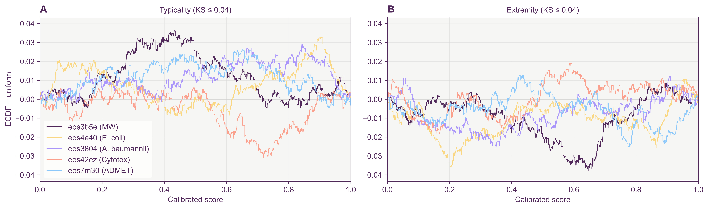
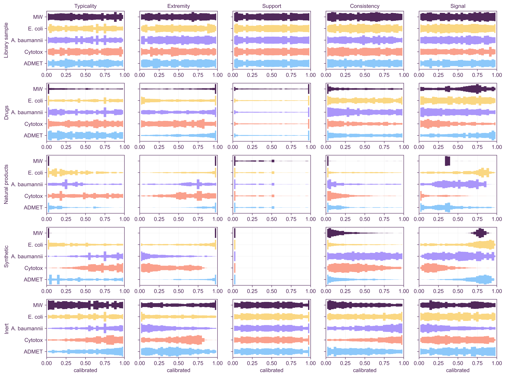
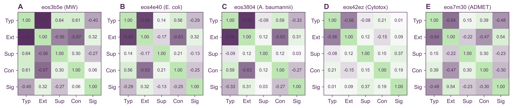
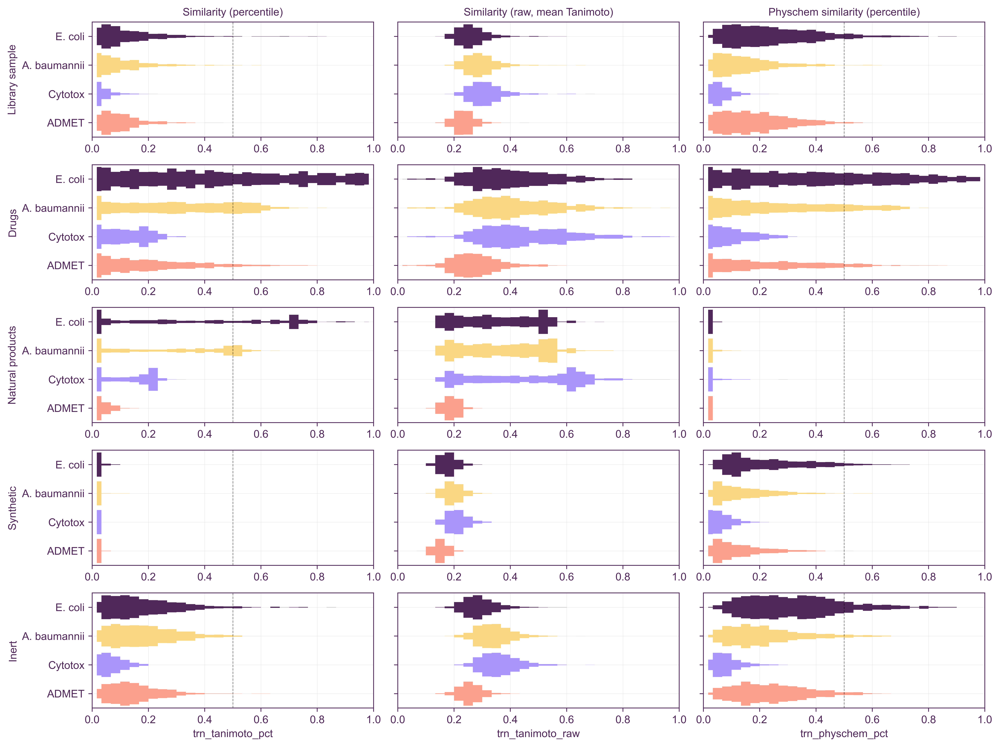

# Project status

**Status:** package `0.1.0`, library `ersilia_reference_library_v0` (1,355,109 molecules), artifact format 11, training format 12. The project is a work in progress. Typicality and extremity are functional and calibrated, and the reference and training match flags are exact lookups.

## Example results

The example models and query sets are those of `scripts/run_all_scores.sh`: it fits every reference score for five Ersilia models (the `emh_paper` fit sets in `data/fit_examples/`) and scores 1,000 molecules from each of five query sets (`data/run_examples/`). The figures in `figures/` are regenerated from its output with `scripts/figures/*.py` (in an environment with stylia).

| model | endpoint | outputs | kept after selection |
|---|---|---|---|
| eos3b5e | molecular weight | 1 | 1 |
| eos4e40 | *E. coli* activity | 1 | 1 |
| eos3804 | *A. baumannii* activity | 1 | 1 |
| eos42ez | cytotoxicity | 3 | 3 |
| eos7m30 | ADMET panel | 49 | 10 |

The query sets, and how many of their molecules the reference library holds (`ref_match` / `ref_scaffold`, the same for every model):

| query set | `ref_match` = 1 | `ref_scaffold` = 1 | no scaffold (NA) |
|---|---|---|---|
| Library sample | 100% | 100% | 0.4% |
| Drugs | 71% | 92% | 10% |
| Inert | 53% | 92% | 0.4% |
| Synthetic | 0% | 21% | 5% |
| Natural products | 0% | 7% | 34% |

`ref_match` ignores stereochemistry, charge and tautomers, so it finds more drugs and inert molecules than an exact SMILES comparison (43% of the drugs, 0.4% of the inert set).

**Calibration.** Library molecules score roughly Uniform(0, 1) on typicality and extremity, and the anchors are 0.500 by construction (mid-rank calibration). On the library sample the KS distance to uniform is at most 0.040 for every model and both scores, against a 95% critical value of 0.043 for n = 1,000.

**Typicality steps.** Typicality's percentile moves in steps for the one-output models because a column's density has only about 130 distinct values across 1.35M molecules (int8 density levels). Ties cannot spread out into a uniform distribution. Mid-rank centres them rather than biasing them upward.

**Redundancy.** For the single-output models typicality and extremity are nearly redundant (Spearman ρ −0.85 to −0.95: a value far from the centre is almost always a rare value); the panels of 3 and 49 outputs are less so (−0.59 and −0.38).

**Cost.** On eos4e40, `fit` with reference and training sets takes about 11 s and `run` on 1,000 molecules about 9 s, with the RDKit descriptors spread over the cores (`-j`). The artifacts are 25–130 MB per model, mostly the training sets (their indices and physchem matrices, shared by columns measured on the same molecules) and the reference CDF tables (11 MB each for typicality and extremity).

## Decisions to review

- **Typicality/extremity redundancy.** Consider reporting only one for single-output models, or replacing extremity with a score that is less tied to density.

## Known limitations

- **Feature selection** keeps at most 10 outputs (10 of 49 for eos7m30). With
  training sets, the candidates are first restricted to the columns that have
  one (41 of eos7m30's 49), and both modalities then use the same 10.
- **Typicality resolution** is limited by int8 quantisation for one-output models (about 130 levels).
- **The match flags** say a structure or scaffold is in the library (or a training set), not that the model's prediction for it is right. Their keys depend on the RDKit version the library was built with: a different installed RDKit is refused, not silently accepted.
- **Library lookup** looks in `./data/indices/` relative to the current working directory. From elsewhere, set `EOSQUALITY_REFERENCE_LIBRARY_PATH` or run `eosquality setup`.
- **Training-set quality is not assessed.** The loader standardises SMILES,
  merges duplicates and reports how many rows it dropped or merged, but a set
  whose assay differs from the deployed model's, or
  which is not actually the model's training data will be scored against
  anyway. `trn_*` answers "how does this molecule relate to the data in this
  folder", not "was this model trained well".

## Training modality (in progress)

Each output column can have its own training set. It is fitted with
`-t/--training-sets`, alone or together with `-r/--reference`; with both, the
reference scores use only the columns that have a training set.

Read that figure critically: against every example query set, including a
sample of the reference library itself, the distance percentile (now published
as the similarity `trn_tanimoto_pct`, one minus it) sits far from the training
set's own typical value and often saturates. That is honest — the training sets hold a few
thousand molecules against a 1.35M-molecule library, so almost any query is
farther from them than their molecules are from each other — but it leaves
the calibrated score with little resolution once everything is "far", which
is why `trn_tanimoto_raw` is reported alongside it.
Drugs are the closest set for eos4e40 (E. coli), whose training data is a
drug-like screen; the synthetic set is the farthest for every model.

| Stage | Adds | Needs | Status |
|---|---|---|---|
| 1 | Training data loader (standardisation, duplicate merging) | SMILES | done |
| 2 | `trn_tanimoto`: one whole-model value per molecule, the Q66 across columns of the mean Morgan distance to the 5 nearest training molecules, published as similarities (`_raw`, and `_pct` calibrated on each column's leave-one-out values; no cutoff) + nearest training molecules | SMILES | done |
| 2b | `trn_physchem` (the same in library-scaled physchem space), `trn_match` and `trn_scaffold` (connectivity-layer lookups) | SMILES | done |

## Open items

Reference modality:

- [ ] Build the match keys for the real library (`eosquality build`) and upload the library folder.
- [ ] Raise the feature-selection cap from 10 to around 30 columns.
- [ ] Decide on typicality/extremity redundancy (see Decisions to review).

Training modality:

- [ ] `trn_tanimoto_pct` saturates near 0 against query sets that are all far
      from the training sets, so its calibrated form loses resolution exactly
      where a user most wants it. Consider a log companion.

General:

- [ ] Before pushing, check that CI passes on GitHub (`.github/workflows/ci.yml`).
